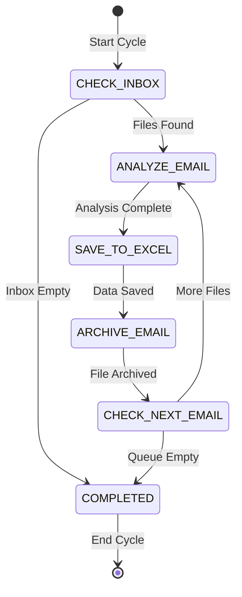

# Email Processing Workflow

## State Machine Diagram



## Data Flow

```
┌─────────────┐
│ data/inbox/ │ ← Email files (.txt) placed here
└──────┬──────┘
       │
       ▼
┌─────────────────┐
│ CHECK_INBOX     │ Scans for .txt files
│ (Tool)          │
└────────┬────────┘
         │
         ▼
┌─────────────────┐
│ ANALYZE_EMAIL   │ AI extracts:
│ (LLM Skill)     │ • Topic
│                 │ • Category
│                 │ • Contacts
│                 │ • Urgency
│                 │ • Sentiment
│                 │ • Summary
└────────┬────────┘
         │
         ▼
┌──────────────────┐
│ SAVE_TO_EXCEL    │ Appends row to Excel
│ (Tool)           │
└────────┬─────────┘
         │
         ▼
┌──────────────────┐
│ ARCHIVE_EMAIL    │ Moves file to archive/
│ (Tool)           │
└────────┬─────────┘
         │
         ▼
┌──────────────────┐
│ CHECK_NEXT_EMAIL │ More files in queue?
│ (Tool)           │
└────────┬─────────┘
         │
         ├─Yes──► (loop back to ANALYZE_EMAIL)
         │
         └─No───► COMPLETED
                       │
                       ▼
                  ┌─────────────────────┐
                  │ data/email_report.  │ ← Results
                  │      xlsx           │
                  └─────────────────────┘

                  ┌─────────────────────┐
                  │ data/archive/       │ ← Processed files
                  └─────────────────────┘
```

## Memory State Structure

```
AgentState
├── working.email_processing
│   ├── inbox_files: ["email_001.txt", "email_002.txt", ...]
│   ├── current_file_index: 0
│   ├── current_file_content: "Subject: ..."
│   ├── current_analysis: EmailAnalysisResult
│   │   ├── main_topic: "Login Error"
│   │   ├── business_category: "Tech Support"
│   │   ├── contact_data: "sarah@company.com"
│   │   ├── urgency: "High"
│   │   ├── sentiment: "Negative"
│   │   ├── summary: "Authentication service down..."
│   │   ├── event_date: 2026-01-17T10:30:00
│   │   └── source_file: "email_001.txt"
│   └── processed_count: 1
│
└── workflow
    ├── current_stage: WorkflowStage.ANALYZE_EMAIL
    ├── goal: "Process emails from inbox folder"
    └── history: [...]
```

## Skill Execution: ANALYZE_EMAIL

**Template**: `src/prompting/jinja/skills/analyze_email.j2`

**Context Variables**:

- `email_content`: Full text of the email
- `file_name`: Name of the email file

**Output Model**: `AnalyzeEmailSkillOutput`

```python
{
    "main_topic": "Login Error",
    "business_category": "Tech Support",
    "contact_data": "sarah.johnson@company.com, +1-555-0123",
    "urgency": "High",
    "sentiment": "Negative",
    "summary": "Authentication service down, blocking client presentation"
}
```

## Tool Execution Examples

### CHECK_INBOX

**Request**: `CheckInboxRequest(inbox_path="data/inbox")`
**Response**:

```python
CheckInboxResponse(
    files=["data/inbox/email_001.txt", "data/inbox/email_002.txt"],
    count=2
)
```

### SAVE_TO_EXCEL

**Request**:

```python
SaveToExcelRequest(
    excel_path="data/email_report.xlsx",
    main_topic="Login Error",
    business_category="Tech Support",
    # ... other fields
)
```

**Response**:

```python
SaveToExcelResponse(
    success=True,
    message="Successfully saved analysis to data/email_report.xlsx"
)
```

### ARCHIVE_EMAIL

**Request**:

```python
ArchiveEmailRequest(
    file_path="data/inbox/email_001.txt",
    archive_path="data/archive"
)
```

**Response**:

```python
ArchiveEmailResponse(
    success=True,
    message="Successfully archived email_001.txt to data/archive/email_001.txt"
)
```

## State Transitions

Each tool/skill updates the state deterministically:

| Action           | State Update                                        | Next Stage                 |
| ---------------- | --------------------------------------------------- | -------------------------- |
| CHECK_INBOX      | `inbox_files = [...]`                               | ANALYZE_EMAIL or COMPLETED |
| ANALYZE_EMAIL    | `current_analysis = EmailAnalysisResult(...)`       | SAVE_TO_EXCEL              |
| SAVE_TO_EXCEL    | (no state change)                                   | ARCHIVE_EMAIL              |
| ARCHIVE_EMAIL    | `processed_count += 1`<br>`current_file_index += 1` | CHECK_NEXT_EMAIL           |
| CHECK_NEXT_EMAIL | (check queue)                                       | ANALYZE_EMAIL or COMPLETED |

## Configuration Flow

```
.env file
    ↓
Environment Variables
    ↓
ToolExecutor.from_env()
    ├── inbox_path = os.getenv("INBOX_PATH", "data/inbox")
    ├── archive_path = os.getenv("ARCHIVE_PATH", "data/archive")
    └── excel_path = os.getenv("EXCEL_PATH", "data/email_report.xlsx")
    ↓
Agent.from_env()
    ├── llm_executor = LLMExecutor.from_env()
    ├── tool_executor = ToolExecutor.from_env()
    └── hello_world_client = HelloWorldClient()
    ↓
main.py → run_email_processing_cycle(agent)
```
